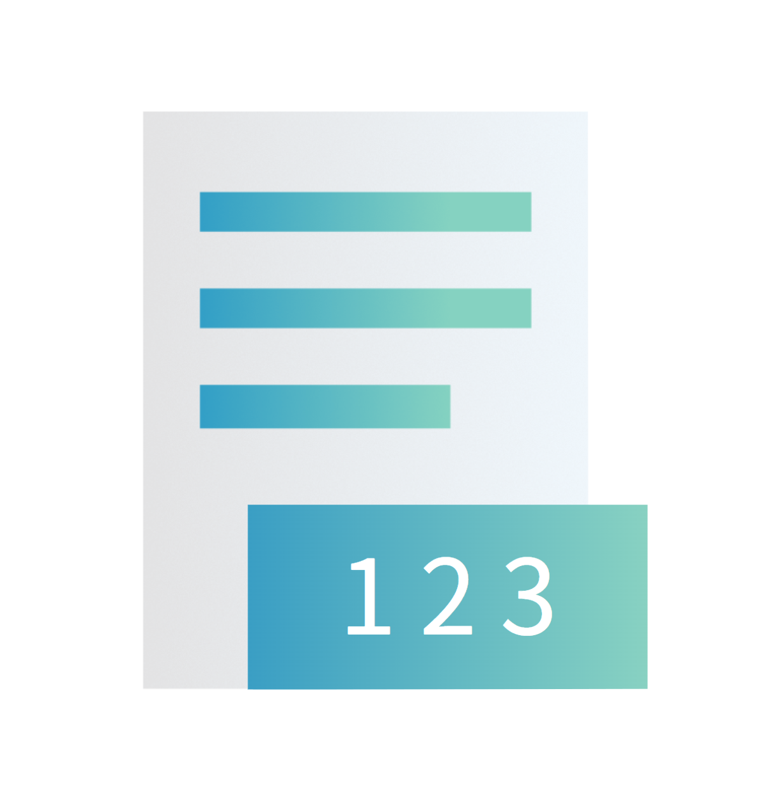

# CharacterCounter
 
文章作成を強力にサポートする高機能な文字数カウンターソフトウェアです。クリップボードの情報を取得し、コピーしたテキストを自動で表示・カウントする便利な機能に特化しています。

**主な機能:**

- **詳細なリアルタイムカウント:** 文字数（空白の有無）、行数、バイト数、原稿用紙の枚数をリアルタイムで表示します。
- **柔軟なテキスト編集:** 外部テキストファイル（.txt）の読み込みと書き出しに対応。テキストのコピーやクリアもワンボタンで実行できます。
- **便利な表示機能:** 「常に最前面に表示」機能を使えば、他のウィンドウを操作しながらでも文字数を確認できます。

ライター、開発者、学生など、文字数を正確に把握する必要があるすべての方の作業を効率化します。
